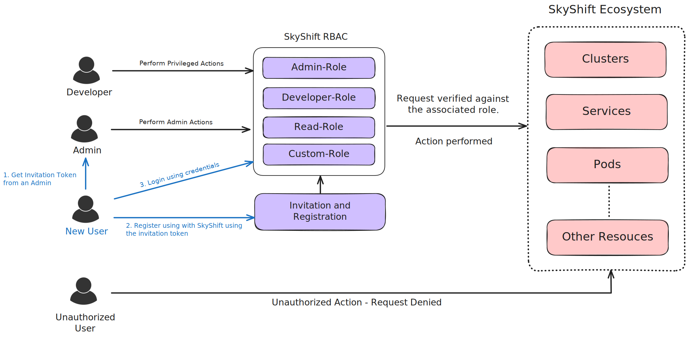

Authentication in SkyShift
============================================

SkyShift utilizes authentication and fine-grained access control over
SkyShift objects. The API utilizes a JWT-based authentication and
role-based access control (RBAC) to ensure secure and efficient access management.

User Registration via Invitation
--------------------------------

User registration in SkyShift is initiated through an invitation system,
where existing users with the necessary permissions can send invitations to
prospective users. This process uses JWTs to secure and specify the parameters
of the invitation.

**Roles:**

1. By default, SkyShift supports "roles" which can be associated with a user
and provide varying access controls. SkyShift comes with three default roles
which can be viewed using:
    `skyctl get roles`

.. code-block:: shell

    ⠙ Fetching roles
    NAME          AGE
    admin-role    3m
    inviter-role  3m
    reader-role   3m

2. Apart from the default roles, additional roles can be created for various
access controls. Role creation can only be done by admins or users having
permissions to create new roles using:
    `skyctl create role my-custom-role --action=create --action=delete --resource=services`

.. code-block:: shell

    ⠙ Creating role
    Created role my-custom-role.
    ✔ Creating role completed successfully.

We can get roles to verify the new role and associated metadata.

.. code-block:: shell

    ⠙ Fetching roles
    NAME            AGE
    admin-role      9m
    inviter-role    9m
    my-custom-role  1m // New role shows up
    reader-role     9m

Similarly, more custom rules can be added to a role via YAML. For example:

.. code-block:: shell

    kind: Role
    metadata:
      name: my-custom-role
      namespaces:
        - default
        - production
    rules:
      - name: my-custom-role-rule
        resources:
          - services
        actions:
          - create
          - delete
    users:
      - user1
      - user2

This can be applied using `skyctl apply -f <path_to_yaml>`
Let's verify the new role creation using YAML.
    `skyctl get roles`

.. code-block:: shell

    ⠙ Fetching roles
    NAME              AGE
    admin-role        2m
    inviter-role      2m
    my-custom-role    1m
    my-custom-role-1  2s
    reader-role       2m

3. Further, authorized users can delete roles specified role from SkyShift which immediately revokes
the role and associated permissions. We can do this using:
    `skyctl delete role my-custom-role`

.. code-block:: shell

    ⠙ Deleting role
    Deleted role my-custom-role.
    ✔ Deleting role completed successfully.

Once the roles are established, we can go ahead and invite new users to SkyShift.

**Invitation Process**
Invitations can be created by already registered users in SkyShift shared with external users for
registration. We will go through basic invite operations.

1. Creating a new invite:
    New invitations can be created using: `skyctl invite --role=reader-role`
    Once the invite is created, the invitation token is visible on the CLI
    and can be shared to new users.

    .. code-block:: shell

        ⠙ Creating inviteInvitation created successfully. Invite: <invitation_token_printed>

2. Registering on SkyShift:
    New users can obtain the invitation token and use it to register on SkyShift.
    This can be done using: `skyctl register <username> <password> --invite <invitation token>`

    .. code-block:: shell

        skyctl register myUsername myPassword --invite <invitation token>

        ⠼ Registering userRegistration successful.
        ✔ Registering user completed successfully.

3. Logging into SkyShift.
    Once the registration process is complete, users can log into SkyShift and perform
    privilegd actions. This can be done using: `skyctl login <username> <password>`

    .. code-block:: shell

        skyctl login myUsername myPassword

        ⠼ Logging inLogin successful. Access token is stored at ~/.skyconf/config.yaml.
        ✔ Logging in completed successfully.

You are now logged in and can manage SkyShift resources.

**Revoking an Invite**
    If an invite token is compromised, it can be revoked to prevent new users from registering using:
    `skyctl revoke_invite <token>`

    .. code-block:: shell

        skyctl revoke_invite my_token

        ⠙ Revoking inviteInvitation revoked. invite `my_token` revoked but it's used already
        ✔ Revoking invite completed successfully.

    This revokes the invite, if the invite was already used, you will see a warning indicating that
    it's already been used.

**SkyShift Auth Flow:**

