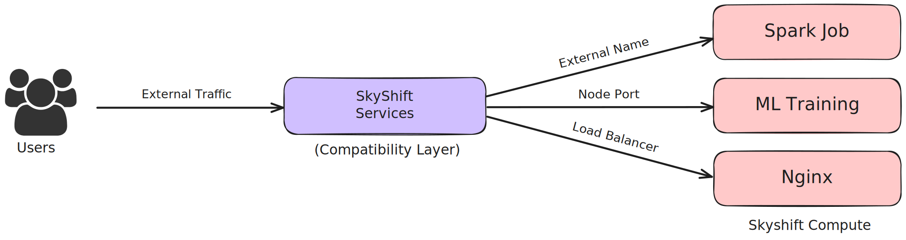

Services in SkyShift CLI
========================

Introduction
------------

In **SkyShift**, a *Service* is an abstraction that expose jobs/deployments/compute on resource managers
like K8s, Ray and Slurm.

This tutorial will guide you through using SkyShift to create, manage, and delete services within your
SkyShift clusters.

Let's creating an Nginx deployment and setup a node port service. For convenience we have provided some
service templates in the examples folder. We will use the Nginx template and setup a node port service on it.

Example: Creating and Exposing an Nginx Job
--------------------------------------------------------

Lets start by creating an Nginx job, monitoring it and accessing it via a node port service.

**Step 1: Create the Job**

First, create a job running Nginx tasks:

.. code-block:: bash

    kind: Job

    metadata:
      name: myservicejob
      labels:
        app: nginx

    spec:
      replicas: 1
      image: nginx:1.14.2
      resources:
        cpus: 0.5
        memory: 128
      ports:
        - 80
      restartPolicy: Always

The above yaml defines an Nginx job with 1 replica running on port 80, with some compute requirements.
Let's apply this job using `skyctl apply -f <path_to_job_yaml>`

.. code-block:: bash

    ⠙ Applying configuration
    Created job myservicejob.
    ✔ Applying configuration completed successfully.

**Step 2: Monitor the Job**

Let's verify the status by doing a `get` on the job using: `skyctl get jobs`

.. code-block:: bash

    ⠙ Fetching jobs
    NAME          CLUSTER           REPLICAS    RESOURCES          NAMESPACE    STATUS    AGE
    myservicejob  kind-testcluster  1/1         cpus: 0.5          default      RUNNING   6s
                                                memory: 128.00 MB
    ✔ Fetching jobs completed successfully.

Now that have the nginx job running, we can create a nodeport service to expose the job.

**Step 3: Creating a NodePort Service**

We can create the service using the following specification:

.. code-block:: bash

    kind: Service

    metadata:
      name: servicedemo

    spec:
      type: NodePort
      primary_cluster: auto
      selector:
        app: nginx
      ports:
        - protocol: TCP
          port: 8080
          node_port: 30012
          target_port: 80

This creates a service called `servicedemo` exposed on node port 30012, and forwarding traffic from port 8080
to the jobs target port 80. This configuration allows us to access the Nginx job running on the cluster.
Let's create this using `skyctl apply -f <path_to_yaml>`:

.. code-block:: bash

    ⠙ Applying configuration
    Created service servicedemo.
    ✔ Applying configuration completed successfully.

**Step 4: Monitoring the Service**

Since the service is created, we can get services to verify the status and it's working.
This can be done using `skyctl get services`

.. code-block:: bash

    ⠙ Fetching services
    NAME         TYPE      CLUSTER-IP    EXTERNAL-IP    PORTS    CLUSTER    NAMESPACE    AGE
    servicedemo  NodePort                               8080:80  auto       default      29m
    ✔ Fetching services completed successfully.

**Step 5: Deleting the Service**

Similar to creation, SkyShift services can also be deleted. The following command can be used for this:
`skyctl delete service servicedemo`

.. code-block:: bash

    ⠙ Deleting service
    Deleted service servicedemo.
    ✔ Deleting service completed successfully.

Let's finally get the status and verify that the service was deleted. `skyctl get services`

.. code-block:: bash

    ⠙ Fetching services
    No services found.
    ✔ Fetching services completed successfully.

We can verify that the service was deleted. Now you start creating your own services in SkyShift!