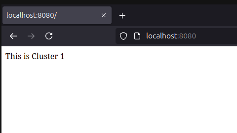

Services in SkyShift CLI
========================

Introduction
------------

In **SkyShift**, a *Service* is an abstraction that expose jobs/deployments/compute on resource managers
like K8s, Ray and Slurm.

.. image:: ../_static/skyshift-services.svg
   :width: 100%
   :align: center
   :alt: SkyShift Services

This tutorial will guide you through using SkyShift to create, manage, and delete services within your
SkyShift clusters.

Let's creating an Nginx deployment and setup a node port service. For convenience we have provided some
service templates in the examples folder. We will use the Nginx template and setup a node port service on it.

Example: Creating and Exposing an Nginx Job
--------------------------------------------------------

We will create 2 SkyShift clusters, and load balance across the 2 clusters.
Cluster 1 has 1 replica and will host the first nginx deployment. Cluster 2 has 2 replicas and will host the
other nginx deployment. Let's start by bootstrapping the clusters and deploy nginx.

You can find the cluster configs and other configs for this tutorial in `examples/load_balancing`

**Step 1: Create the Cluster**
First, create a Cluster1 with an appropriate label which will later be used for deployments:

Let's create the cluster using: `kind create cluster --name cluster1`

.. code-block:: bash

    Creating cluster "cluster1" ...
     ✓ Ensuring node image (kindest/node:v1.27.1) 🖼
     ✓ Preparing nodes 📦
     ✓ Writing configuration 📜
     ✓ Starting control-plane 🕹️
     ✓ Installing CNI 🔌
     ✓ Installing StorageClass 💾
    Set kubectl context to "kind-cluster1"

Similarly, let's create another cluster cluster2 using `kind create cluster --name cluster2`

Now that the clusters are setup and running, let's add them to SkyShift with appropriate labels.

`skyctl create cluster kind-cluster1 -l name kind-cluster1`

.. code-block:: bash

    ⠹ Creating cluster
    Created cluster kind-cluster1.
    ✔ Creating cluster completed successfully.

Similar to this let's also create the cluster2 using: `skyctl create cluster kind-cluster2 -l name kind-cluster2`

Let's get the current clusters to check if everything is running as expected using `skyctl get clusters`

.. code-block:: bash

    ⠙ Fetching clusters
    NAME           MANAGER    LABELS               RESOURCES                  STATUS    AGE
    kind-cluster1  k8         name: kind-cluster1  cpus: 14.05/16.0           READY     1m
                                                   memory: 14.81 GB/15.35 GB
                                                   disk: 151.13 GB/151.13 GB
    kind-cluster2  k8         name: kind-cluster2  cpus: 30.95/32.0           READY     29s
                                                   memory: 30.36 GB/30.69 GB
                                                   disk: 302.26 GB/302.26 GB

Great! Now we have both the clusters up and running with the expected labels. Let's now deploy the nginx jobs.

**Step 2: Deploying Nginx jobs**

Let's use the latest nginx docker image and deploy to cluster1 using: `skyctl apply -f <path to cluster1-job.yaml>`

.. code-block:: bash

    ⠙ Applying configuration
    Created job nginx.
    ✔ Applying configuration completed successfully.

Similarly let's deploy to cluster 2 as well: `skyctl apply -f <path to cluster2-job.yaml>`
Please note that there will be actual applications in typical usecases, in this case, we are assuming that
the application itself is an nginx deployment.

Let's verify if the jobs are running as expected using `skyctl get jobs`

.. code-block:: bash

    ⠙ Fetching jobs
    NAME    CLUSTER        REPLICAS    RESOURCES          NAMESPACE    STATUS    AGE
    nginx   kind-cluster1  1/1         cpus: 0.5          default      RUNNING   46m
                                       memory: 128.00 MB
    nginx2  kind-cluster2  2/2         cpus: 0.5          default      RUNNING   46m
                                       memory: 128.00 MB
    ✔ Fetching jobs completed successfully.

We can see both the jobs are now running and nginx2 in cluster2 is running with 2 replicas.

**Step 3: Creating NodePort Services**

Now that the nginx deployments and clusters are running, we can expose them using nodeport services,
which will allow traffic to reach the deployments.

This can be done using `skyctl apply -f <path to cluster1-service.yaml>`

.. code-block:: bash

    ⠙ Applying configuration
    Created service nginx-service.
    ✔ Applying configuration completed successfully.

Similarly, let's expose the second deployment with `skyctl apply -f <path to cluster2-service.yaml>`

For a sanity check, lets make sure everything is working as expected by inspecting the kubernetes pods
using `kubectl get pods --context kind-cluster1`

.. code-block:: bash

    kubectl get pods --context kind-cluster1
    NAME                              READY   STATUS    RESTARTS   AGE
    cl-controlplane-fcd6f44d6-pzp7t   1/1     Running   0          64m
    cl-dataplane-7985b87db6-cbzsq     1/1     Running   0          64m
    gwctl                             1/1     Running   0          64m
    nginx-f8e04002-7b8ff8d57b-q8lt2   1/1     Running   0          49m
    nginx-lb-75db845984-t4r8k         1/1     Running   0          39m

    ~kubectl get pods --context kind-cluster2
    NAME                              READY   STATUS    RESTARTS   AGE
    cl-controlplane-fcd6f44d6-vc5bj   1/1     Running   0          64m
    cl-dataplane-7985b87db6-zzt2s     1/1     Running   0          64m
    gwctl                             1/1     Running   0          64m
    nginx2-8ecc1c07-dc9c9d845-jp2l6   1/1     Running   0          50m
    nginx2-8ecc1c07-dc9c9d845-p6qz6   1/1     Running   0          50m

We can see everything is running as expected, let's move to the next steps.

**Step 4: Configuring load balancer**

Since we have two applications running in both the clusters, let's setup a load balancer on cluster1
which will redirect traffic to the 2 deployments across multiple replicas in cluster1 and cluster2.

Let's configure another job which will be the load balancer. We must configure certain fields to instruct
nginx to redirect traffic to the appropriate destinations. (Refer to load-balancing/nginx-load-balancer.yaml).

Let's add the IP address of the destinations we have just configured. This can be obtained using:
`docker inspect -f '{{range.NetworkSettings.Networks}}{{.IPAddress}}{{end}}' cluster2-control-plane`
and `docker inspect -f '{{range.NetworkSettings.Networks}}{{.IPAddress}}{{end}}' cluster1-control-plane`

This will give the IP addresses that the load balancer needs to forward the traffic to. Feel free to configure
more addresses if your usecases has more clusters/replicas.

Once this is done, we can apply the config using: `kubectl apply -f nginx-load-balancer.yaml --context kind-cluster1`

.. code-block:: bash

    deployment.apps/nginx-lb created
    configmap/nginx-lb-config configured

This will create a deployment and a configmap to support it. Finally, we can expose a service which will be the
entrypoint to all the traffic to the load-balancer.
This can be done using: `skyctl apply -f <path to nginx-lb-service.yaml>`

.. code-block:: bash

    ⠙ Applying configuration
    Created service nginx-lb-service.
    ✔ Applying configuration completed successfully.

    //Checking all the services running as expected.

    $ skyctl get services
    ⠙ Fetching services
    NAME              TYPE      CLUSTER-IP     EXTERNAL-IP    PORTS    CLUSTER        NAMESPACE    AGE
    nginx-lb-service  NodePort  10.96.216.132                 80:80    kind-cluster1  default      1h
    nginx-service     NodePort  10.96.34.141                  80:80    kind-cluster1  default      1h
    nginx-service2    NodePort  10.96.144.59                  80:80    kind-cluster2  default      1h
    ✔ Fetching services completed successfully.

Now the the service is deployed, we can send traffic to it. To verify it, let's update the index page for
both the deployments to verify load balancing.

Let's update the landing page using: `kubectl exec -it <pod_cluster1> --context kind-cluster1 -- /bin/bash -c "echo 'This is Cluster 1' > /usr/share/nginx/html/index.html"`

Similarly let's use a different title for cluster2 using `kubectl exec -it <pod_cluster2> --context kind-cluster2 -- /bin/bash -c "echo 'This is Cluster 2' > /usr/share/nginx/html/index.html"`

**Step 5: Monitoring and Sending Traffic**

Now that everything is setup, let's send some traffic and test it out. Let's portfoward localhost to the
load-balancer service using: `kubectl port-forward service/nginx-lb-service 8080:80 --context kind-cluster1`

Now the localhost:8080 will be accessable and route traffic to the 2 clusters randomly. Le'ts refresh the
page couple of times to verify the traffic to both clusters.

We see traffic going to cluster1, and cluster2, now you can setup your own services with SkyShift.
