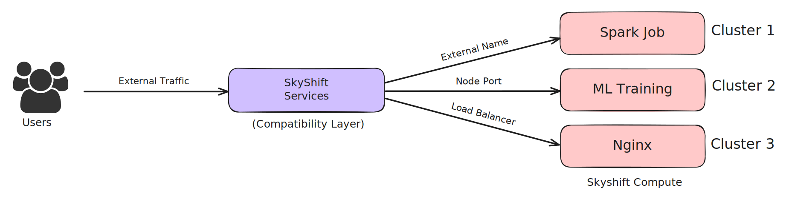

Services in SkyShift CLI
========================

Introduction
------------

In **SkyShift**, a *Service* is an abstraction that expose jobs/deployments/compute on resource managers
like K8s, Ray and Slurm.

This tutorial will guide you through using SkyShift to create, manage, and delete services within your
SkyShift clusters.

Let's creating an Nginx deployment and setup a node port service. For convenience we have provided some
service templates in the examples folder. We will use the Nginx template and setup a node port service on it.

Example: Creating and Exposing an Nginx Job
--------------------------------------------------------

We will create 2 SkyShift clusters, and load balance across the 2 clusters.
Cluster 1 has 1 replica and will host the first nginx deployment. Cluster 2 has 2 replicas and will host the
other nginx deployment. Let's start by bootstrapping the clusters and deploy nginx.

You can find the cluster configs and other configs for this tutorial in `examples/load_balancing`

**Step 1: Create the Cluster**
First, create a Cluster1 with an appropriate label which will later be used for deployments:
If you already have kind clusters running, SkyShift will automatically detect live kind clusters when launched.
Let's create the cluster using: `kind create cluster --name cluster1`

.. code-block:: bash

    Creating cluster "cluster1" ...
     ✓ Ensuring node image (kindest/node:v1.27.1) 🖼
     ✓ Preparing nodes 📦
     ✓ Writing configuration 📜
     ✓ Starting control-plane 🕹️
     ✓ Installing CNI 🔌
     ✓ Installing StorageClass 💾
    Set kubectl context to "kind-cluster1"

Similarly, let's create another cluster cluster2 using `kind create cluster --name cluster2`

Now that the clusters are setup and running, let's add them to SkyShift with appropriate labels.

`skyctl create cluster kind-cluster1 -l name kind-cluster1`

.. code-block:: bash

    ⠹ Creating cluster
    Created cluster kind-cluster1.
    ✔ Creating cluster completed successfully.

Similar to this let's also create the cluster2 using: `skyctl create cluster kind-cluster2 -l name kind-cluster2`

Let's get the current clusters to check if everything is running as expected using `skyctl get clusters`

.. code-block:: bash

    ⠙ Fetching clusters
    NAME           MANAGER    LABELS               RESOURCES                  STATUS    AGE
    kind-cluster1  k8         name: kind-cluster1  cpus: 14.05/16.0           READY     1m
                                                   memory: 14.81 GB/15.35 GB
                                                   disk: 151.13 GB/151.13 GB
    kind-cluster2  k8         name: kind-cluster2  cpus: 30.95/32.0           READY     29s
                                                   memory: 30.36 GB/30.69 GB
                                                   disk: 302.26 GB/302.26 GB

Great! Now we have both the clusters up and running with the expected labels. Let's setup MetalLB load balancer using:

  `kubectl apply -f https://raw.githubusercontent.com/metallb/metallb/v0.13.10/config/manifests/metallb-native.yaml --context kind-cluster1`

Check the status of pods managed by metallb using:

.. code-block:: bash

    kubectl get pods -n metallb-system
    NAME                          READY   STATUS    RESTARTS   AGE
    controller-595f88d88f-rqg68   1/1     Running   0          123m
    speaker-6cwth                 1/1     Running   0          123m
    speaker-mjzz2                 1/1     Running   0          123m
    speaker-qczch                 1/1     Running   0          123m

Once the pods are up and running, we can apply the following configuration to provide available IP range to MetalLB.
`kubectl apply -f <path to cluster1-metallb-config.yaml>`

.. code-block:: bash

    kubectl apply -f cluster1-metallb-config.yaml  --context kind-cluster1
    ipaddresspool.metallb.io/ip-pool-cluster1 unchanged
    l2advertisement.metallb.io/l2-advertisement-cluster1 unchanged

**Step 2: Deploying Nginx jobs**

Let's use the latest nginx docker image and deploy to cluster1 using: `skyctl apply -f <path to cluster1-job.yaml>`

.. code-block:: bash

    ⠙ Applying configuration
    Created job nginx.
    ✔ Applying configuration completed successfully.

Similarly let's deploy to cluster 2 as well: `skyctl apply -f <path to cluster2-job.yaml>`
Please note that there will be actual applications in typical usecases, in this case, we are assuming that
the application itself is an nginx deployment.

Let's verify if the jobs are running as expected using `skyctl get jobs`

.. code-block:: bash

    ⠙ Fetching jobs
    NAME    CLUSTER        REPLICAS    RESOURCES          NAMESPACE    STATUS    AGE
    nginx   kind-cluster1  1/1         cpus: 0.5          default      RUNNING   46m
                                       memory: 128.00 MB
    nginx2  kind-cluster2  2/2         cpus: 0.5          default      RUNNING   46m
                                       memory: 128.00 MB
    ✔ Fetching jobs completed successfully.

We can see both the jobs are now running and nginx2 in cluster2 is running with 2 replicas.

**Step 3: Creating Services**

Now that the nginx deployments and clusters are running, we can expose them using nodeport services,
which will allow traffic to reach the deployments.

This can be done using `skyctl apply -f <path to cluster1-service.yaml>`

.. code-block:: bash

    ⠙ Applying configuration
    Created service nginx-service.
    ✔ Applying configuration completed successfully.

Similarly, let's expose the second deployment with `skyctl apply -f <path to cluster2-service.yaml>`

For a sanity check, lets make sure everything is working as expected by inspecting the kubernetes pods
using `kubectl get pods --context kind-cluster1`

.. code-block:: bash

    kubectl get pods --context kind-cluster1
    NAME                              READY   STATUS    RESTARTS   AGE
    cl-controlplane-fcd6f44d6-pzp7t   1/1     Running   0          64m
    cl-dataplane-7985b87db6-cbzsq     1/1     Running   0          64m
    gwctl                             1/1     Running   0          64m
    nginx-f8e04002-7b8ff8d57b-q8lt2   1/1     Running   0          49m
    nginx-lb-75db845984-t4r8k         1/1     Running   0          39m

    ~kubectl get pods --context kind-cluster2
    NAME                              READY   STATUS    RESTARTS   AGE
    cl-controlplane-fcd6f44d6-vc5bj   1/1     Running   0          64m
    cl-dataplane-7985b87db6-zzt2s     1/1     Running   0          64m
    gwctl                             1/1     Running   0          64m
    nginx2-8ecc1c07-dc9c9d845-jp2l6   1/1     Running   0          50m
    nginx2-8ecc1c07-dc9c9d845-p6qz6   1/1     Running   0          50m

We can see everything is running as expected, let's move to the next steps.

**Step 4: Configuring load balancer**

Since we have two applications running in both the clusters, let's setup a load balancer on cluster1
which will redirect traffic to the 2 deployments across multiple replicas in cluster1 and cluster2.

Let's launch a SkyShift job to setup nginx to serve as reverse proxy to both clusters

.. code-block:: bash

    CLUSTER2_IP=$(docker inspect -f '{{range.NetworkSettings.Networks}}{{.IPAddress}}{{end}}' cluster2-control-plane) && \
    CLUSTER1_IP=$(docker inspect -f '{{range.NetworkSettings.Networks}}{{.IPAddress}}{{end}}' cluster1-control-plane) && \
    sed -i "s/__CLUSTER2_IP__/${CLUSTER2_IP}/g" nginx-load-balancer.yaml && \
    sed -i "s/__CLUSTER1_IP__/${CLUSTER1_IP}/g" nginx-load-balancer.yaml && \
    skyctl apply -f nginx-load-balancer.yaml

    ⠙ Applying configuration
    Created job nginx-lb.
    ✔ Applying configuration completed successfully.

Finally, we can setup a LoadBalancer type service to allow traffic to reach the nginx job.
Note: This relies on the MetalLB setup done in the beginning of this guide.

.. code-block:: bash

    $ skyctl apply -f nginx-lb-service.yaml
    ⠙ Applying configuration
    Created service nginx-lb-service.
    ✔ Applying configuration completed successfully.

Let's verify the status of all services:

.. code-block:: bash

    $ skyctl get services
    ⠙ Fetching services
    NAME              TYPE          CLUSTER-IP    EXTERNAL-IP    PORTS    CLUSTER        NAMESPACE    AGE
    nginx-lb-service  LoadBalancer                               80:80    kind-cluster1  default      1m
    nginx-service     NodePort      10.96.66.20                  80:80    kind-cluster1  default      2h
    nginx-service2    NodePort      10.96.186.91                 80:80    kind-cluster2  default      2h
    ✔ Fetching services completed successfully.

Now the the service is deployed, we can send traffic to it. To verify it, let's update the index page for
both the deployments to verify load balancing.

Let's update the landing page using: `kubectl exec -it <pod_cluster1> --context kind-cluster1 -- /bin/bash -c "echo 'This is Cluster 1' > /usr/share/nginx/html/index.html"`

Similarly let's use a different title for cluster2 using `kubectl exec -it <pod_cluster2> --context kind-cluster2 -- /bin/bash -c "echo 'This is Cluster 2' > /usr/share/nginx/html/index.html"`

**Step 5: Monitoring and Sending Traffic**

Let's send some traffic and test it out. Let's portfoward localhost to the load-balancer service using: `kubectl port-forward service/nginx-lb-service 8080:80 --context kind-cluster1`

Now the localhost:8080 will be accessable and route traffic to the 2 clusters randomly. Le'ts refresh the
page couple of times to verify the traffic to both clusters.

.. image:: ../_static/cluster1.png
   :width: 50%
   :align: center
   :alt: Cluster1

.. image:: ../_static/cluster1.png
   :width: 50%
   :align: center
   :alt: Cluster2

We see traffic going to cluster1, and cluster2, now you can setup your own services with SkyShift.
